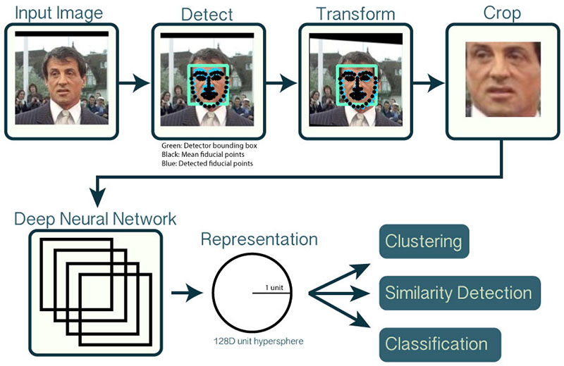

# Face Recognition Architecture



# File Usage and Description
## network_image.py:
```python
python network_image.py -d face_detection_model -r output/recognizer.pickle  -l output/le.pickle
```
Will start the verification server listening to the incomming verificaiton request

## extract_embeddings.py: 
```python
python extract_embeddings.py -i dataset -e output/embeddings.pickle -d face_detection_model
```
Will detect face uisng caffe people decetion model and cropped the face and  extract the encoding 128 features out of each face save in to the database.<br\>

## extract_embeddings_al.py: 
```python
python extract_embeddings_al.py -i dataset -e output/embeddings.pickle -d face_detection_model -s shape_predictor_68_face_landmarks.dat
```
Same as above , but with affine transform to align the face before embedding , using dlib face detector.

## train_model.py:
```python
python train_model.py -e output/embeddings.pickle -r output/recognizer.pickle -l output/le.pickle
```
Using svm to classify the data from previous step encoding and output the recognizer trained using svm and label back to database

## face.py:
```python
python face_img.py -d face_detection_model -r output/recognizer.pickle -l output/le.pickle
```
Using the caffe face dection model and the previously trained svm recognizer to claffify the incomming image in a video stream

## face_al.py:
```python
python face_al.py -s shape_predictor_68_face_landmarks.dat -d face_detection_model -r output/recognizer.pickle -l output/le.pickle
```
Same as above ,except using the dlib face dector with face aligned

## face_al_img.py:
```python
python face_al_img.py -s shape_predictor_68_face_landmarks.dat -d face_detection_model -r output/recognizer.pickle -l output/le.pickle
```
Same as above ,except go through all the image in test with face aligned.

## face_al_img.py:
```python
python face_img.py -s shape_predictor_68_face_landmarks.dat -d face_detection_model -r output/recognizer.pickle -l output/le.pickle
```
Same as above ,except go through all the image in test with face not aligned.

## Other Utilities
  * fr_utils.py 
  * inception_blocks_v2.py


